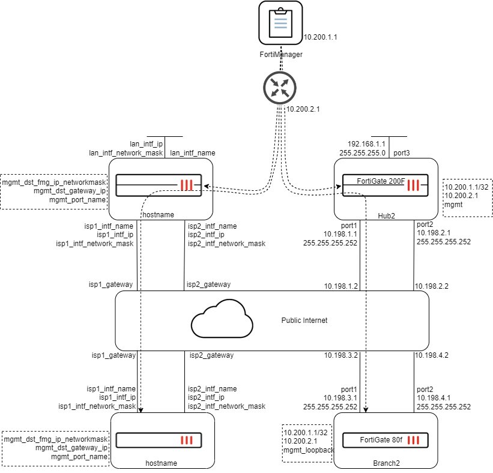

# SD-WAN Dual Hub Primary/Secondary Deployment

This use case builds an SD-WAN hub and spoke solution with two Hub FortiGates and multiple branches. The solution generates a SD-WAN overlay network that utilizes BGP for routing and ADVPN 2.0 for building shortcuts between the branches.

This FortiEngage template utilizes Jinja scripts to initialize devices in FortiManager and configure the SD-WAN Overlay Orchestrator for a [Dual Hub primary/secondary SD-WAN architecture](https://docs.fortinet.com/document/fortigate/7.2.0/sd-wan-architecture-for-enterprise/644109/multiple-datacenters-primary-secondary-gateways), as described in the [SD-WAN Architecture for Enterprise guide](https://docs.fortinet.com/document/fortigate/7.2.0/sd-wan-architecture-for-enterprise/342022/introduction). 

Two CSV files are used to provide the scripts parameters specific to each deployment, such as interface IP addresses, hostnames, serial numbers, etc.

## Topology

As illustrated in the topology, two hubs are deployed in different locations for redundancy purposes. Two branch sites connect to the hubs to access applications hosted in the datacenter as well as applications hosted at each branch site. More branch sites may be provisioned.

The primary hub is preferred, such that traffic will pass through the primary hub as long as one of the WAN links are considered "alive" by SD-WAN. Traffic will failover to the secondary hub when both WAN links are dead or out of SLA.

## Design overview

The deployment involves a greenfield rollout of Fortinet Secure SD-WAN devices, with hub FortiGates strategically positioned in private locations such as headquarters, data centers, or cloud environments. These hubs serve as the secure gateway for remote branch locations, enabling access to essential local applications and services. Each branch establishes four SD-WAN overlay VPN connections to the hub’s WAN interfaces, ensuring robust connectivity. Traffic is efficiently directed across links using SD-WAN rules, while performance SLAs help assess link suitability for specific application needs. BGP routing facilitates seamless communication across the network, and ADVPN enhances branch-to-branch connectivity. 

## Main Components

This SD-WAN implementation leverages three key features or components. These components are in addition to the SD-WAN secure, reliable, and scalable connectivity across various locations while centralizing management and visibility over the network. The following table outlines the components and the method chosen based on best practices.

| Component | Method | Benefits |
|-------|---------| --------- |
| Overlay routing | BGP on Loopback | The branch FortiGates peer with hub FortiGtes using each FortiGate's loopback interface, resulting in one neighbor adjacency between the branch and hub. This is in contrast to BGP per overlay where the BGP adjacencies are formed for each overlay, resulting in several neighbor adjacencies for each branch and spoke. |
| Overlay network | ADVPN 2.0 | ADVPN 2.0 allows branches to make a more informed decision about which underlay to form ADVPN shortcut tunnels over. Edge discovery provides the initiating branch the ability to learn the status of the receiving branch's WAN links, enabling the best performing link to be used, as well as the ability to build new shortcuts to ensure the best link is always being used. |
| Route exchange | Dynamic BGP | Dynamic BGP allows for branch FortiGates to form a BGP neighbor adjacency with other branch FortiGates once an ADVPN tunnel shortcut has been established. This means that the hub FortiGates do not have to reflect branch networks from one branch to the rest, resulting in lower resource utilization on the hub FortiGates. |

## Prerequisites

The following prerequesites define required FortiGate and FortiManager configuration that is not provided by FortiEngage:

- FortiGates are on 7.6.1 or higher
- FortiManager is 7.6.4 or higher
- The configuration of all hub and branch FortiGates should be in their factory default state
- Each hub has two redundant WAN connections
- Each branch has two redundant WAN connections
- WAN connections are public links that can reach all other device WAN interfaces in the region

## Planning

When planning a SD-WAN deployment, the following settings must be considered and planned for.

### Loopback IP address space

Hub devices utilize two loopbacks:

- HUB-Lo
	- Used for health checks from branch devices to measure VPN tunnel performance.
	- Each hub will use the same IP address for this loopback interface. 
- BGP-Lo
	- Used for BGP peering between branch and hub devices.
	- Interface IP must be unique for each hub.
	
Branch devices utilize one loopback:

- Branch-Lo
	- Used to form BGP peering with hubs and other branches when ADVPN shortcuts are established.

It is recommended to use a loopback subnet that can contain all the branch and hub loopbacks.

Example use of 172.16.0.0/16:
- 172.16.0.#/32 can be used for branch loopbacks
- 172.16.255.254/32 can be used for HUB-Lo on both hubs
- 172.16.255.253/32 can be used for BGP-Lo for Hub1
- 172.16.255.252/32 can be used for BGP-Lo for Hub2

### Autonomous System number for BGP
	
A private number is used and must remain exclusively for this SD-WAN BGP configuration.

### Branch LAN IP address space

Branches should use subnets that can be readily supernetted, or summarized by a larger subnet. For example:

Branch1: 10.1.1.0/24

Branch2: 10.1.2.0/24

...

Branch10: 10.1.10.0/24

These branch subnets may be summarized with the supernet: 10.1.0.0/16.

This is useful for advertising branch LAN reachability from the hub.

**[Note]** As an alternative, default routes may be implemented on each branch to direct non-internet destined traffic to the hub, which is particularly useful when branch LANs are not easily summarized by one or a few routes from the hub. 

## Deployment

To begin deployment, your topology parameters must be parsed into the two CSV files. 

### device_info.csv

This CSV file defines the FortiGates parameters and is used to configure a fresh FortiGate in a zero or low-touch provisioning style. See [Zero-touch and low-touch provisioning](https://docs.fortinet.com/document/fortimanager/7.6.3/administration-guide/155479/zero-touch-and-low-touch-provisioning) in the FortiManager admin guide.

Some of the variables will be taken from a topology, where as others are specific to the deployment, such as FortiGate model and pre-shared keys.

The following topology maps the variables expected in the CSV file to a dual hub topology. The left side shows the mapping and the right side shows example values.

Using this example, the CSV file is as follows:

| Serial Number | PSK | Device Group | Name | OS Version | Device Type | Split Port | isp1_intf_name | isp2_intf_name | lan_intf_name | lan_intf_ip | lan_intf_network_mask | isp1_intf_ip | isp1_intf_network_mask | isp1_gateway | isp2_intf_ip | isp2_intf_network_mask | isp2_gateway | hostname | mgmt_dst_fmg_ip_networkmask | mgmt_dst_gateway_ip | mgmt_port_name |
|-|-|-|-|-|-|-|-|-|-|-|-|-|-|-|-|-|-|-|-|-|-|
| n/a | fortinet123 | Hub_grp | Hub2 | 7 | FortiGate-200F | Y | port1 | port2 | port3 | 192.168.1.1 | 255.255.255.0 | 10.198.1.1 | 255.255.255.252 | 10.198.1.2 | 10.198.2.1 | 255.255.255.252 | 10.198.2.2 | Hub1 | 10.200.1.1/32 | 10.200.2.1 | mgmt |
| n/a | fortinet123 | Branch_grp | Branch2 | 7 | FortiGate-80F | Y | port1 | port2 | port3 | 10.1.2.0 | 255.255.255.0 | 10.198.3.1 | 255.255.255.252 | 10.198.3.2 | 10.198.4.1 | 255.255.255.252 | 10.198.4.2 | Branch1 | 10.200.1.1/32 | 10.200.2.1 | mgmt_loopback |

### sdwan_overlay_info.csv

This CSV file defines the SD-WAN overlay settings used by Hub and Branch devices. The following variables must be defined:

#### loop_back_ip

This subnet defines the address space for:
	Branch BGP loopback interface
	Hub BGP loopback interface
	Hub health check loopback interface
	
The SD-WAN overlay template will assign addresses starting from the highest address of the subnet range for hub devices, and starting from the lowest for branch devices. Using 172.16.0.0 as an example, Hub loopbacks will begin with 172.16.0.254, .253, etc. And branch devices will begin with 172.16.0.1, .2, etc.

**!!should this field ask for subnet mask as well? The SOT uses both.**

#### as_id

The Autonomous System ID is used by BGP to define routing policies and mechanisms for devices in that AS. The AS number range of 64512 - 65534 is reserved for private use within enterprise networks and it is recommended to select a number from this range.

#### hub1_host_name | hub2_host_name

The SD-WAN overlay orchestrator uses these values to assign the generated configuration templates to the managed device of that name. 

#### branch_grp_name

The name for a device group that contains the branch devices. This value must match the same as configured in device_info.csv.

#### hub1_underlay_link1_name

The interface name on the Hub1 FortiGate for the first WAN connection. The value provided here must match the interface name exactly as seen on the FortiGate (e.g. port1, or internal1).

#### hub1_underlay_link2_name

The interface name on the Hub1 FortiGate for the second WAN connection. The value provided here must match the interface name exactly as seen on the FortiGate (e.g. port1, or internal1).

#### hub2_underlay_link1_name

The interface name on the Hub2 FortiGate for the first WAN connection. The value provided here must match the interface name exactly as seen on the FortiGate (e.g. port1, or internal1).

#### hub1_underlay_link2_name

The interface name on the Hub1 FortiGate for the second WAN connection. The value provided here must match the interface name exactly as seen on the FortiGate (e.g. port1, or internal1).

#### hub1_underlay_link1_ip

The IP address of the first WAN interface for Hub1.

#### hub1_underlay_link2_ip

The IP address of the second WAN interface for Hub1.

#### hub2_underlay_link1_ip

The IP address of the first WAN interface for Hub2.

#### hub2_underlay_link2_ip

The IP address of the second WAN interface for Hub2.

#### branch_underlay_link1_name

The interface name on branch FortiGates for the first WAN connection. The value provided here must match the interface name exactly as seen on the FortiGate (e.g. port1, or internal1).

#### branch_underlay_link2_name

The interface name on branch FortiGates for the second WAN connection. The value provided here must match the interface name exactly as seen on the FortiGate (e.g. port1, or internal1).

#### policy_hub_src_interface

Used to define a sample policy on the hubs.

#### policy_hub_dst_interface

Used to define a sample policy on the hubs.

#### policy_branch_src_interface

Used to define a sample policy on the branches.

#### policy_branch_dst_interface

Used to define a sample policy on the branches.
